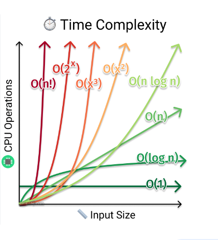

# 🔶 11. Liste chaînée ou linked list
## A Docstring Discord Challenge #11

Un peu de théorie derrière nos algos...

👉 Vous savez peut-être que les structures de données sont très liées à l'algorithmie. En effet les performances de vos algorithmes dépendent des bons choix de vos structures de base.

Je vous propose aujourd'hui de créer une [liste chaînée](https://fr.wikipedia.org/wiki/Liste_cha%C3%AEn%C3%A9e#:~:text=Une%20liste%20cha%C3%AEn%C3%A9e%20ou%20liste,d'un%20pointeur%20vers%20une) qui est une structure de données très répandue ; la connaissance de son fonctionnement est essentielle afin de pouvoir résoudre divers problèmes de la vie courante.

Nous profiterons de cet exercice pour se focaliser sur les [Comparaisons asymptotiques](https://fr.wikipedia.org/wiki/Comparaison_asymptotique#:~:text=lorsque%20x%20varie.-,%C3%89chelle%20de%20comparaison,-%5Bmodifier%20%7C) ou plus communément appelées <em>Big O notation</em> en anglais.

### 🔹 Étapes

1. Créez une liste chaînée de base, cette liste devra contenir 2 variables qui permettront de pointer directement sur le 1er et le dernier élément de la liste. De plus, chacun des nœuds devront bien sûr comporter 2 valeurs : `value` et `next_link`
2. Ajouter les fonctions de base suivantes : `append(value)`, `remove_at(index)`, `insert(index, value)`, `contains(value)`, `index_of(value)`, `at_index(index)` et `len(list)` ainsi que l'affichage simple de la liste résultante à l'aide la fonction `print()`.
3. Développez la fonction `is_unique()` qui renvoie `False` si la liste contient des doublons et `True` si chacun des éléments de la liste est unique.
4. Pour finir, créez la fonction `reversed()` qui permet de changer l'ordre de votre liste.

<strong>Bonus</strong> : Créez une fonction permettant de convertir votre liste chaînée en liste standard Python.

Dans cet exercice, <strong>la performances de votre algorithme est une priorité</strong>, les formateurs seront là pour vous guider et vous expliquer ce que l'on entend par "bon algorithme".  


### 🔹 Conditions

- L'affichage se fait via la console
- N'importez pas de module de liste chaînée déjà existant, le but est de créer votre propre code
- Gestion des messages d'erreurs
- Réfléchissez aux performances de votre algo qui devra être pensé pour pouvoir gérer un nombre conséquent de données.  
(Renseignez vous aussi sur les différences de performance entre une liste chaînée simple et double).

Précisions sur les fonctions à développer :
- `append(value:int|str)-> None` permet d'ajouter un élément à la fin de la liste
- `remove_at(index:int)-> None` retire un élément à l'index donné
- `insert(index:int, value:int|str)-> None` insère un élément à l'index donné
- `contains(value:int|str)-> bool` vérifie que value est présent dans la liste
- `index_of(value:int|str)-> int` renvoie l'index de la première valeur rencontrée, -1 si value n'est pas présente dans la liste
- `at_index(index)-> int|str` renvoie la valeur à l'index donné
- `len(llist)-> int` renvoie le nombre d'éléments contenus dans la liste chaînée, passée en argument
- `print(llist)-> str` affiche la chaîne de caractères pour représenter le contenu de la liste
- `is_unique()-> bool` vérifie que la liste ne contient pas de doublons
- `reversed()-> None` inverse le sens de la liste chaînée

### 🔹 Exemples

```Python
llist = Llist()
print(llist) -> []

llist.append(3)
llist.append(10)
llist.append(30)
print(len(llist)) -> 3
print(llist) -> [3, 10, 30]

llist.insert(1, 50)
print(llist) -> [3, 50, 10, 30]

llist.remove_at(0)
print(llist) -> [50, 10, 30]

print(llist.contains(10)) -> True
print(llist.contains(87)) -> False

print(llist.index_of(10)) -> 1
print(llist.index_of(87)) -> -1

print(llist.at_index(1)) -> 10

print(llist.is_unique()) -> True
llist.append(50)
print(llist) -> [50, 10, 30, 50]
print(llist.is_unique()) -> False

llist.append(20)
llist.append(100)
llist.append(80)
print(llist) -> [50, 10, 30, 50, 20, 100, 80]
llist.reversed()
print(llist) -> [80, 100, 20, 50, 30, 10, 50]
```

